# Lekérdezés optimalizálás labor

## Feladat 1

A kiadott parancsok:

- `select * from vevo`
- `select * from vevo where id = 1`
- a többi is hasonló, csak az `id` mezőt használjuk

A lekérdezési terv mindegyikre nagyon hasonló, mindegyik _table scan_-t használt:

Magyarázat: az optimalizáló nem tud indexet használni, a tárolás sorrendjével kapcsolatban sem élhet feltételezéssel, így minden lekérdezés _table scan_ lesz.

## Feladat 2

a) A kiadott parancsok:

- `select * from vevo`

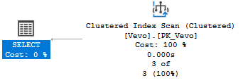

Magyarázat: Elsődleges kulcs mentén létrejön a Clustered Index, a tábla rekordjai index szerint növekvő sorrendben vannak tárolva, így a lekérdező index szerint végig megy a táblán.

b) A kiadott parancsok:

- `select * from vevo where id = 1`

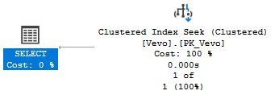

Magyarázat: Clustered Index Seekre változott, mert a feltétel az elsődleges kulccsal ellátott oszlop egy elemére vonatkozik.

c) A kiadott parancsok:

- `select * from vevo where id <> 1`

A lekérdezési terv nem változott.

Magyarázat: Az optimalizáló külön-külön kiértékeli az id hol nagyobb és hol kisebb mint 1. A lekérdezés elsődleges kulcsra vonatkozik, ezért nagyon gyors.

d) A kiadott parancsok:

- `select * from vevo where id > 1`

A lekérdezési terv nem változott.

Magyarázat: Ugyanúgy, mint az előző, de csak egy intervallummal.

e) A kiadott parancsok:

- `select * from vevo where id > 1 order by id desc`

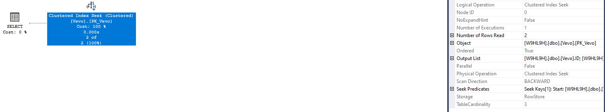

Magyarázat: Az optimalizáló kikeresi a határon lévő rekordot (ahol id = 1) és onnan visszafele indul el, így a rekordok az eredményben eleve csökkenő sorrendben vannak rendezve.

## Feladat 3

f) A kiadott parancsok:

- `select * from termek`

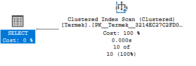

Magyarázat: Lásd Feladat 2 a).

g) A kiadott parancsok:

- `select * from termek where NettoAr = 800`

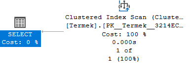 TODO

Magyarázat: Az egyenlőségi feltétel nem elsődleges kulcsra vonatkozik, így a teljes táblát végig kell nézni és mindenhol ki kell érteklni a feltételt.

h) A kiadott parancsok:

- `select * from termek where NettoAr <> 800`

A lekérdezési terv ugyanaz marad.

Magyarázat: Nincs változás, mert még mindig nem elsődleges kulcsra vonatkozik a feltétel.

i) A kiadott parancsok:

- `select * from termek where NettoAr > 800`

A lekérdezési terv ugyanaz marad.

Magyarázat: Nincs változás, mert még mindig nem elsődleges kulcsra vonatkozik a feltétel.

j) A kiadott parancsok:

- `select * from termek where NettoAr > 800 order by NettoAr desc`

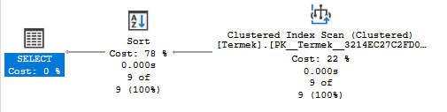

Magyarázat: Scan után van még egy költséges rendezés, mivel a kiolvasott rekordok nem NettoAr, hanem id szerint vannak rendezve eredetileg.

## Feladat 4

f) A kiadott parancsok:

- `select * from termek`

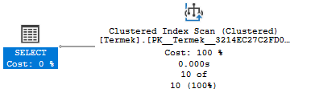

Magyarázat: Nem számít, hogy van-e indexünk vagy nincs, teljes tábla lekérdezésénél az optimalizálónak mindig végig kell mennie az összes rekordon.

g) A kiadott parancsok:

- `select * from termek where NettoAr = 800`

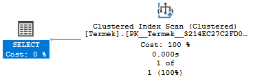

Magyarázat: Ha az optimalizáló a létrehozott index alapján dolgozik, akkor onnan először rekord referenciákat kap vissza, ami alapján még ki kell keresnie a tényleges rekordokat. Mivel a termék tábla kicsi, ezért az optimalizó dönthet úgy, hogy kisebb költséggel jár kiolvasni az egész táblát mint referenciákkal játszani.

h) A kiadott parancsok:

- `select * from termek where NettoAr <> 800`

A lekérdezési terv ugyanaz marad.

Magyarázat: Lásd Feladat 4 g).

i) A kiadott parancsok:

- `select * from termek where NettoAr > 800`

A lekérdezési terv ugyanaz marad.

Magyarázat: Lásd Feladat 4 g).

j) A kiadott parancsok:

- `select * from termek where NettoAr > 800 order by NettoAr desc`

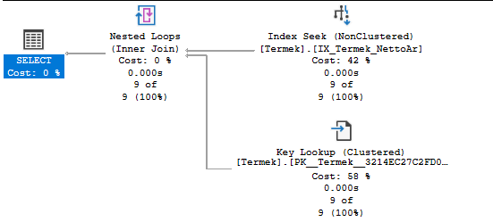

Magyarázat: A Non-Clustered index visszaadja a referenciákat, amik alapján kikeressük a rekordokat és mivel a referenciák sorrendben vannak, ezért ha ezekhez kigyűjtjük az egyes rekordokat ezzel megspórolható a rendezés.

## Feladat 5

f) A kiadott parancsok:
- `select * from termek`

Magyarázat: Nincs változás Feladat 4 f)-hez képest.

g) A kiadott parancsok:
- `select * from termek where NettoAr = 800`

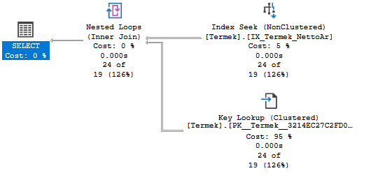

Magyarázat: Sima Clustered index scan nagy méretű táblára nagyon drága. Mivel a NettoAr oszlopra az egyenlőség operátor nagyon jól szűr (valószínűleg nagyon kevés rekordban szerepel ugyanaz az érték), így a Non-Clustered index tényleg a segítségünkre lehet.

h) A kiadott parancsok:
- `select * from termek where NettoAr <> 800`

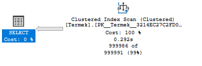

Magyarázat: Ha az egyenlőség operátor jól szűr, akkor a nem-egyenlőség nem jól szűr, így mindenképpen sok rekordot kell végigolvasni, nincs értelme Non-Clustered indexet használni.

i) A kiadott parancsok:
- `select * from termek where NettoAr > 800`

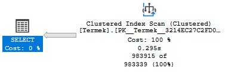

Magyarázat: A lekérdezés végrahajtási terve attól függ, hogy milyen konstanst választunk. Ha az adott konstans jól szűr (pl. nagy szám) akkor használja a Non-Clustered index scant, ha viszont rosszul szűr akkor Clustered index scant fog használni.

j) A kiadott parancsok:
- `select * from termek where NettoAr > 800 order by NettoAr desc`

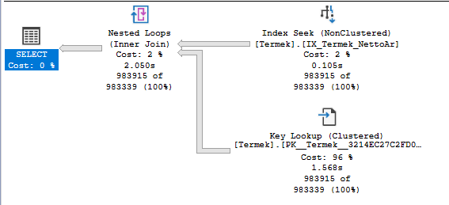

Magyarázat: Mindegy, hogy a megadott konstans jól vagy rosszul szűr, az optimalizálónak fontosabb, hogy elkerülje a költséges rendezést, ezért használni fogja a Non-Clustered indexet.

## Feladat 6

f) A kiadott parancsok:

- `select id, NettoAr from termek`

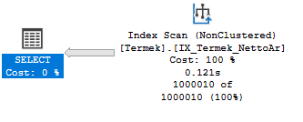

Magyarázat: Mivel nem az egész rekordra kérdezünk rá, hanem csak olyan oszlopokra amiken van index, ezért az optimalizáló tudja használni a korábban létrehozott Non-Clustered indexet (NettoAr oszlopon) és csak index alapján hajtja végre a keresést.

g) A kiadott parancsok:

- `select id, NettoAr from termek where NettoAr = 800`

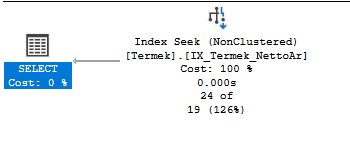

Magyarázat: Nincs szükség Join-ra, mert a kapott referenciákból az optimalizáló az index alapján ki tudja olvasni a lekérdezésben szereplő mindkét mezőt.

h) A kiadott parancsok:

- `select id, NettoAr from termek where NettoAr <> 800`

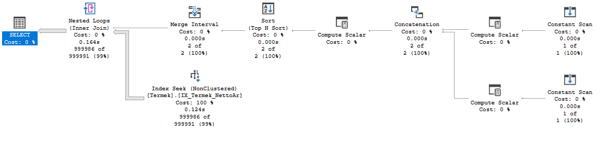

Magyarázat: Az optimalizáló a sorokat Non-Clustered Index Seek segítségével választja ki, az ID és a NettoAr oszlopokra pedig az ábrán lévő fenti utat használja. ???

i) A kiadott parancsok:

- `select id, NettoAr from termek where NettoAr > 800`

Lekérdezési terv ugyanaz mint Feladat 6 g)-nél.

Magyarázat: Lásd Feladat 6 g).

j) A kiadott parancsok:

- `select id, NettoAr from termek > 800 order by NettoAr desc`

Lekérdezési terv ugyanaz mint Feladat 6 g)-nél.

Magyarázat: Lásd Feladat 6 g).

## Feladat 7

k) A kiadott parancsok:

- `select * from termek where id between 10 and 30`

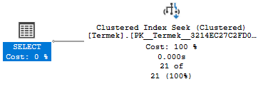

Magyarázat: Az id oszlopon lévő Clustered indexet használja a rekordok megkeresésére. Az index bejegyzések sorba rendezett tulajdonsága miatt könnyű volt az intervallumra szűrni.

l) A kiadott parancsok:

- `select * from termek where (id between 10 and 30) or id = 100`

Lekérdezési terv ugyanaz mint Feladat 7 k)-nál.

Magyarázat: Az intervallumra és egy konkrét értékre továbbra is egyszerű szűrni a Clustered index-szel.

## Feladat 8

m) A kiadott parancsok:

- `select id, NettoAr from termek where cast(NettoAr as int) = 800`

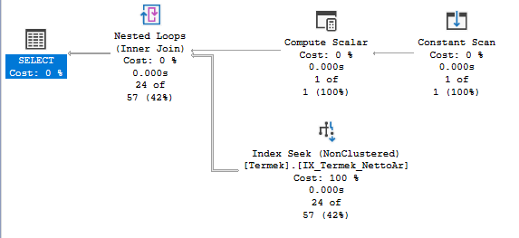

Magyarázat: Mindkét esetben egy Nonclustered index seek eljárást választ egy Tól-ig tartományban. Az első esetben ezzel párhuzamosan megtörténik egy castolás a NettoAr oszlopra majd ennek végeredményét egy nested loop join összeköti az előző kereséssel. ???

n) A kiadott parancsok:

- `select id, NettoAr from termek where NettoAr BETWEEN 800-0.0001 AND 800+0.0001`

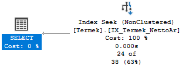

Magyarázat: 

## Feladat 9

o) A kiadott parancsok:

- `select * from termek where NettoAr < 20 order by id desc`

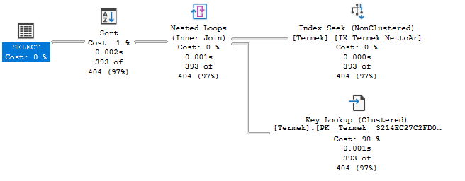

Magyarázat: 

p) A kiadott parancsok:

- `select id, NettoAr from termek where NettoAr < 20 order by id desc`

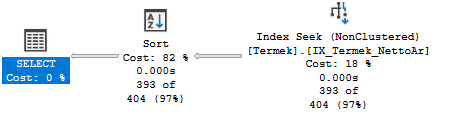

Magyarázat: 

q) A kiadott parancsok:

- `select * from termek where NettoAr > 20 order by id desc`

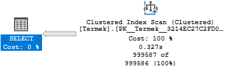

Magyarázat: 

r) A kiadott parancsok:

- `select id, NettoAr from termek where NettoAr > 20 order by id desc`

Magyarázat: 

## Feladat 10

s) A kiadott parancsok:

- `select id, Nev from termek where SUBSTRING(nev, 1, 1) = 'Z'`

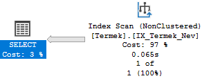

Magyarázat: 

t) A kiadott parancsok:

- `select id, Nev from termek where Nev like 'Z%'`

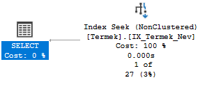

Magyarázat: 

u) A kiadott parancsok:

- `select id, Nev from termek where Nev like '%Z%'`

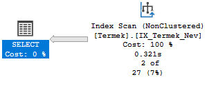

Magyarázat: 

v) A kiadott parancsok:

- `select id from termek where Nev = 'Zenélo bébitelefon'`

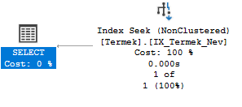

Magyarázat: 

w) A kiadott parancsok:

- `select id from termek where UPPER(Nev) = 'ZENÉLŐ BÉBITELEFON'`

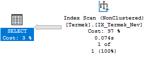

Magyarázat: 

## Feladat 11

x) A kiadott parancsok:

- `select MAX(id) from termek`

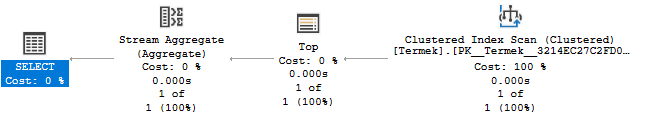

Magyarázat: 

y) A kiadott parancsok:

- `select MIN(NettoAr) from termek`

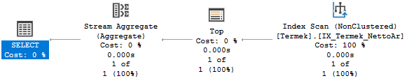

Magyarázat: 

## Feladat 12

A kiadott parancsok:

- `select kategoria.nev, COUNT(*) from termek, kategoria where termek.kategoriaid = kategoria.id group by kategoria.nev`

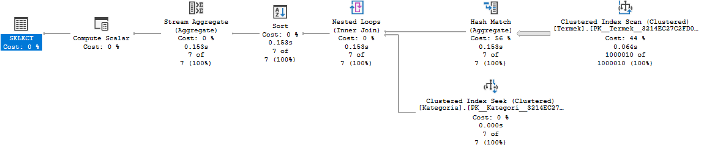

- `select COUNT(*) from termek group by kategoriaid`

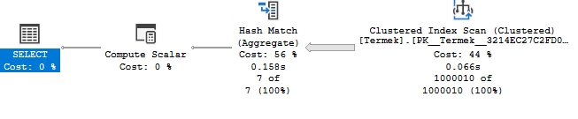

Magyarázat: 

## Feladat 13

A kiadott parancsok:

- új index a KategoriaId oszlopra

## Feladat 14

A kiadott parancsok:

- `select nev from termek where kategoriaid = 9`

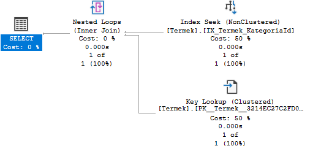

## Feladat 15

A kiadott parancsok:

- `select nev from termek where kategoriaid = 9`

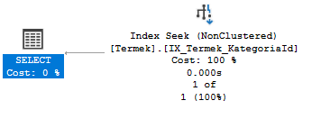
