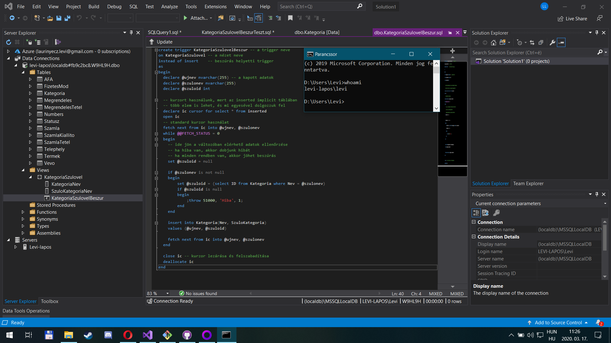

# Lekérdezés optimalizálás labor

## Feladat 1

A kiadott parancsok:

- `select * from vevo`
- `select * from vevo where id = 1`
- a többi is hasonló, csak az `id` mezőt használjuk

A lekérdezési terv mindegyikre nagyon hasonló, mindegyik _table scan_-t használt:

Magyarázat: az optimalizáló nem tud indexet használni, a tárolás sorrendjével kapcsolatban sem élhet feltételezéssel, így minden lekérdezés _table scan_ lesz.

## Következő nagyon izgalmas feladat

Add meg a használt SQL utasításokat. Ha egy feladatban nagyon hasonlóak (mint fentebb), nem szükséges mindegyiket megadod, csak jelezd 1-2 példával.

A kapott lekérdezési tervet képként tedd be. Ha a lekérdezési tervek nagyon hasonlóak (mint az első feladatban), elég csak egyet megmutatnod.

Értékeld a kapott tervet, magyarázd meg, mit látsz, és miért.
