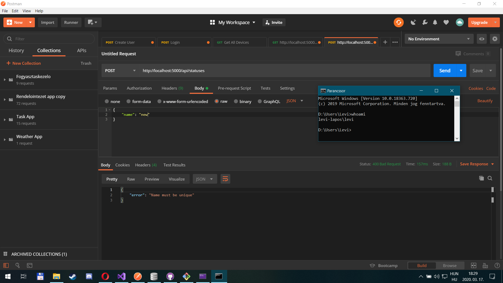

# Lekérdezés optimalizálás labor

## Feladat 1

A kiadott parancsok:

- `select * from vevo`
- `select * from vevo where id = 1`
- a többi is hasonló, csak az `id` mezőt használjuk

A lekérdezési terv mindegyikre nagyon hasonló, mindegyik _table scan_-t használt:

Magyarázat: az optimalizáló nem tud indexet használni, a tárolás sorrendjével kapcsolatban sem élhet feltételezéssel, így minden lekérdezés _table scan_ lesz.

## Feladat 2

a) A kiadott parancsok:

- `select * from vevo`

Magyarázat: Elsődleges kulcs mentén létrejön a Clustered Index, a tábla rekordjai index szerint növekvő sorrendben vannak tárolva, így a lekérdező index szerint végigmegy a táblán.

b) A kiadott parancsok:

- `select * from vevo where id = 1`

Magyarázat: Clustered Index Seekre változott, mert a feltétel az elsődleges kulccsal ellátott oszlop egy elemére vonatkozik.

c) A kiadott parancsok:

- `select * from vevo where id <> 1`

A lekérdezési terv nem változott.

Magyarázat: Az optimalizáló külön-külön kiértékeli az id hol nagyobb és hol kisebb mint 1. A lekérdezés elsődleges kulcsra vonatkozik, ezért nagyon gyors.

d) A kiadott parancsok:

- `select * from vevo where id > 1`

A lekérdezési terv nem változott.

Magyarázat: Ugyanúgy, mint az előző, de csak egy intervallummal.

e) A kiadott parancsok:

- `select * from vevo where id > 1 order by id desc`

Magyarázat: Az optimalizáló kikeresi a határon lévő rekordot (ahol id = 1) és onnan visszafele indul el, így a rekordok az eredményben eleve csökkenő sorrendben vannak rendezve.

## Feladat 3

f) A kiadott parancsok:

- `select * from termek`

Magyarázat: Lásd Feladat 2 a).

g) A kiadott parancsok:

- `select * from termek where NettoAr = 800`

Magyarázat: Az egyenlőségi feltétel nem elsődleges kulcsra vonatkozik, így a teljes táblát végig kell nézni és mindenhol ki kell értékelni a feltételt.

h) A kiadott parancsok:

- `select * from termek where NettoAr <> 800`

A lekérdezési terv ugyanaz marad.

Magyarázat: Nincs változás, mert még mindig nem elsődleges kulcsra vonatkozik a feltétel.

i) A kiadott parancsok:

- `select * from termek where NettoAr > 800`

A lekérdezési terv ugyanaz marad.

Magyarázat: Nincs változás, mert még mindig nem elsődleges kulcsra vonatkozik a feltétel.

j) A kiadott parancsok:

- `select * from termek where NettoAr > 800 order by NettoAr desc`

Magyarázat: Scan után van még egy költséges rendezés, mivel a kiolvasott rekordok nem NettoAr, hanem id szerint vannak rendezve eredetileg.

## Feladat 4

f) A kiadott parancsok:

- `select * from termek`

Magyarázat: Nem számít, hogy van-e indexünk vagy nincs, teljes tábla lekérdezésénél az optimalizálónak mindig végig kell mennie az összes rekordon.

g) A kiadott parancsok:

- `select * from termek where NettoAr = 800`

Magyarázat: Ha az optimalizáló a létrehozott index alapján dolgozik, akkor onnan először rekord referenciákat kap vissza, ami alapján még ki kell keresnie a tényleges rekordokat. Mivel a termék tábla kicsi, ezért az optimalizó dönthet úgy, hogy kisebb költséggel jár kiolvasni az egész táblát mint referenciákkal játszani.

h) A kiadott parancsok:

- `select * from termek where NettoAr <> 800`

A lekérdezési terv ugyanaz marad.

Magyarázat: Lásd Feladat 4 g).

i) A kiadott parancsok:

- `select * from termek where NettoAr > 800`

A lekérdezési terv ugyanaz marad.

Magyarázat: Lásd Feladat 4 g).

j) A kiadott parancsok:

- `select * from termek where NettoAr > 800 order by NettoAr desc`

Magyarázat: A Non-Clustered index visszaadja a referenciákat, amik alapján kikeressük a rekordokat és mivel a referenciák sorrendben vannak, ezért ha ezekhez kigyűjtjük az egyes rekordokat ezzel megspórolható a rendezés.

## Feladat 5

f) A kiadott parancsok:
- `select * from termek`

Magyarázat: Nincs változás a Feladat 4 f)-hez képest.

g) A kiadott parancsok:
- `select * from termek where NettoAr = 800`

Magyarázat: Sima Clustered index scan nagy méretű táblára nagyon drága. Mivel a NettoAr oszlopra az egyenlőség operátor nagyon jól szűr (valószínűleg nagyon kevés rekordban szerepel ugyanaz az érték), így a Non-Clustered index tényleg a segítségünkre lehet.

h) A kiadott parancsok:
- `select * from termek where NettoAr <> 800`

Magyarázat: Ha az egyenlőség operátor jól szűr, akkor a nem-egyenlőség nem jól szűr, így mindenképpen sok rekordot kell végigolvasni, nincs értelme Non-Clustered indexet használni.

i) A kiadott parancsok:
- `select * from termek where NettoAr > 800`

Magyarázat: A lekérdezés végrahajtási terve attól függ, hogy milyen konstanst választunk. Ha az adott konstans jól szűr (pl. nagy szám) akkor használja a Non-Clustered index scant, ha viszont rosszul szűr akkor Clustered index scant fog használni.

j) A kiadott parancsok:
- `select * from termek where NettoAr > 800 order by NettoAr desc`

Magyarázat: Mindegy, hogy a megadott konstans jól vagy rosszul szűr, az optimalizálónak fontosabb, hogy elkerülje a költséges rendezést, ezért használni fogja a Non-Clustered indexet.

## Feladat 6

f) A kiadott parancsok:

- `select id, NettoAr from termek`

Magyarázat: Mivel nem az egész rekordra kérdezünk rá, hanem csak olyan oszlopokra amiken van index, ezért az optimalizáló tudja használni a korábban létrehozott Non-Clustered indexet (NettoAr oszlopon) és csak index alapján hajtja végre a keresést.

g) A kiadott parancsok:

- `select id, NettoAr from termek where NettoAr = 800`

Magyarázat: A tábla nagy mérete és a feltételt kielégítő kevés rekord miatt (NettoAr = 800 jól szűr) az optimalizáló Index Seeket használ. Nincs szükség Join-ra, mert a kapott referenciákból az optimalizáló az index alapján ki tudja olvasni a lekérdezésben szereplő mindkét mezőt.

h) A kiadott parancsok:

- `select id, NettoAr from termek where NettoAr <> 800`

Magyarázat: A lekérdezést két intervallumra bontja az optimalizáló (< 800 és > 800). Ehhez tudja használni a NettoAr oszlopra definiált indexet és így a két részeredményt összerakva megkapja az eredményt.

i) A kiadott parancsok:

- `select id, NettoAr from termek where NettoAr > 800`

Lekérdezési terv ugyanaz mint Feladat 6 g)-nél.

Magyarázat: Lásd Feladat 6 g).

j) A kiadott parancsok:

- `select id, NettoAr from termek > 800 order by NettoAr desc`

Lekérdezési terv ugyanaz mint Feladat 6 g)-nél.

Magyarázat: Lásd Feladat 6 g). Az index referenciákat ad vissza és mivel a referenciák sorrendben vannak, ezért ha ezekhez kigyűjtjük az egyes rekordokat akkor megspórolható a rendezés.

## Feladat 7

k) A kiadott parancsok:

- `select * from termek where id between 10 and 30`

Magyarázat: Az id oszlopon lévő Clustered indexet használja a rekordok megkeresésére. Az indexbejegyzések sorba rendezett tulajdonsága miatt könnyű volt az intervallumra szűrni.

l) A kiadott parancsok:

- `select * from termek where (id between 10 and 30) or id = 100`

Lekérdezési terv ugyanaz mint Feladat 7 k)-nál.

Magyarázat: Az intervallumra és egy konkrét értékre továbbra is egyszerű szűrni a Clustered index-szel.

## Feladat 8

m) A kiadott parancsok:

- `select id, NettoAr from termek where cast(NettoAr as int) = 800`

Magyarázat: A castolás során az optimalizáló a 800-at castolja floattá (olcsóbb egy db integert floattá konvertálni, mint sok floatot integerré) és használja a NettoAr indexet, mert erre vonatkozott a szűrés.

n) A kiadott parancsok:

- `select id, NettoAr from termek where NettoAr BETWEEN 800-0.0001 AND 800+0.0001`

Magyarázat: Hasonló az előzőhöz (az eredményhalmaz meg is egyezik), de itt egyenlőség helyett egy nagyon szűk intervallumra szűrünk, amihez jól használható az Index Seek.

## Feladat 9

o) A kiadott parancsok:

- `select * from termek where NettoAr < 20 order by id desc`

Magyarázat: Az optimalizáló Index Seeket használva (mert a NettoAr < 20 kevés rekordra igaz) kiszűri a feltételt teljesítő rekordokat, amik NettoAr alapján vannak rendezve. A rekordok összes mezőjére kíváncsiak vagyunk, ezért az optimalizálónak ezeket külön meg kell keresnie a kiszűrt rekordokhoz. Plusz mi NettoAr helyett id alapján történő rendezést akarunk, ezért az alapján még rendezi az eredményt.

p) A kiadott parancsok:

- `select id, NettoAr from termek where NettoAr < 20 order by id desc`

Magyarázat: Hasonló az előzőhöz, de az összes mező helyett csak az id és NettoAr mezőkre vagyunk kíváncsiak (mindkettőre van index definiálva), ezért elmarad a Key Lookup és Join rész.

q) A kiadott parancsok:

- `select * from termek where NettoAr > 20 order by id desc`

Magyarázat: A NettoAr > 20 rosszul szűr, ezért a várhatóan nagy eredményhalmaz miatt Index Seek helyett Index Scant használ. Mivel a teljes elsődleges indexet végigolvassa, ezért nincs szükség rendezésre, mert az elsődleges indexben már id alapján vannak rendezve a rekordok.

r) A kiadott parancsok:

- `select id, NettoAr from termek where NettoAr > 20 order by id desc`

A lekérdezési terv nem változott.

Magyarázat: Hasonló az előzőhöz, de nincs jelentősége annak, hogy csak az id és NettoAr mezők érdekelnek minket, mert így is végigolvassa az egész elsődleges indexet.

## Feladat 10

s) A kiadott parancsok:

- `select id, Nev from termek where SUBSTRING(nev, 1, 1) = 'Z'`

Magyarázat: A Substring függvényhívásnál az optimalizáló nem tud Index Seeket használni, mert a függvénynek nem tudja előre megmondani a visszatérési értékét. Ezért az egész index táblát végigolvassa és minden rekordra alkalmazza a Substring függvényt.

t) A kiadott parancsok:

- `select id, Nev from termek where Nev like 'Z%'`

Magyarázat: Hasonló az előzőhöz, de a LIKE 'Z%' feltétel már lehetővé teszi a rendezettség kihasználását, ezért Index Seeket használ az optimalizáló.

u) A kiadott parancsok:

- `select id, Nev from termek where Nev like '%Z%'`

Magyarázat: Index Scant használ, mert a feltétel miatt a rendezettség nem kihasználható, és a teljes index végigolvasásra kerül.

v) A kiadott parancsok:

- `select id from termek where Nev = 'Zenélo bébitelefon'`

Magyarázat: Index Seeket használ, mert az egyenlőség ellenőrzésénél kihasználható a rendezettség.

w) A kiadott parancsok:

- `select id from termek where UPPER(Nev) = 'ZENÉLŐ BÉBITELEFON'`

Magyarázat: Az Upper is függvényhívás, lásd Feladat 10 s).

## Feladat 11

x) A kiadott parancsok:

- `select MAX(id) from termek`

Magyarázat: Az indexben a bejegyzések (és a rekordok) id alapján vannak rendezve, az optimalizáló a legutolsó indexbejegyzéssel kezdi a szűrést (BACKWARD scan), de a TOP 1 miatt az utolsón kívül nem is olvas ki mást.

y) A kiadott parancsok:

- `select MIN(NettoAr) from termek`

Magyarázat: Hasonló az előzőhöz, a különbség annyi, hogy a NettoAr oszlopra létrehozott indexet használja, mert most a NettoAr minimumára vagyunk kíváncsiak.

## Feladat 12

A kiadott parancsok:

- `select kategoria.nev, COUNT(*) from termek, kategoria where termek.kategoriaid = kategoria.id group by kategoria.nev`

- `select COUNT(*) from termek group by kategoriaid`

Magyarázat: Az optimalizáló előnyben részesíti a Hash Match Aggregate-t, ha nagy rekordszámmal és kevés csoporttal van dolga (jelen esetben: ~1 milló rekord, 7 csoport), ezért használja most ezt. Index Scant használ, mert az összes rekordot meg kell vizsgálnia.

## Feladat 13

A kiadott parancsok:

- új index a KategoriaId oszlopra

Magyarázat: Az új indexben az indexbejegyzések KategoriaId alapján vannak rendezve, ezt végigolvasva az azonos kategóriához tartozó rekordok közvetlen egymás után vannak, ezért nincs szükség Hash Match Aggregate-re. Az előzőhöz hasonlóan megint Index Scant használ.

## Feladat 14

A kiadott parancsok:

- `select nev from termek where kategoriaid = 9`

Magyarázat: Az optimalizáló az előző feladatban felvett indexet használta, mert a szűrés kategoriaid alapján történt. Index Seeket használt, mert a feltételnek kevés rekord felel meg. Ezután a megtalált rekordoknak az id-jük alapján megkereste a nev mező értékét.

## Feladat 15

A kiadott parancsok:

- `select nev from termek where kategoriaid = 9`

Magyarázat: Az előzőhöz hasonlóan az új indexet és Index Seeket használ az optimalizáló. Itt azért nincs szükség Key Lookupra, mert a indexet kiegészítettük a nev oszloppal, ezért csak az indexbejegyzésekből kiolvasható az eredmény.